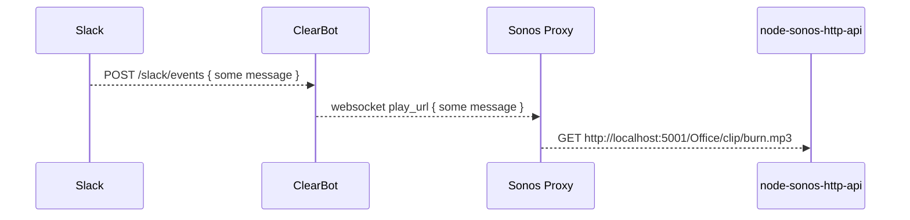

# Sonos Proxy

This code is a proxy between the
[clearbot](https://github.com/clearfunction/clearbot) and the
[node-sonos-http-api](https://github.com/jishi/node-sonos-http-api) library.

## Architecture



## Requirements

- Yarn
- Node

## Running Locally

- Put some mp3s in the `static/clips` directory
- Set up your `.env` file (see `.env.example`)
- If you don't have a Sonos speaker, then you can still use the local player... just ensure you've got `USE_LOCAL_SOUNDS` set to `true`
- If you _do_ have a Sonos speaker, then you'll also need the `node-sonos-http-api` running locally
- Ensure your `clearbot` is running. It has its own documentation.
- Run `yarn dev`
- Wait for the `Connected to http://...` message. It finds the speaker prior to starting socket connection to the bot.

## In the office

We set this up with
[`pm2`](http://pm2.keymetrics.io/docs/usage/quick-start/#setup-startup-script)
to daemonize it on the Mac Mini in our closet.  Let's see how it works out for
us!

```sh
yarn                   # installs this app
yarn global add pm2    # installs the daemonizer
pm2 start ./server.js --name sonos_proxy  # assumes you're in this app's folder, starts the daemon
pm2 save               # saves the running process as a daemon that will be auto-restarted even after reboots
```
