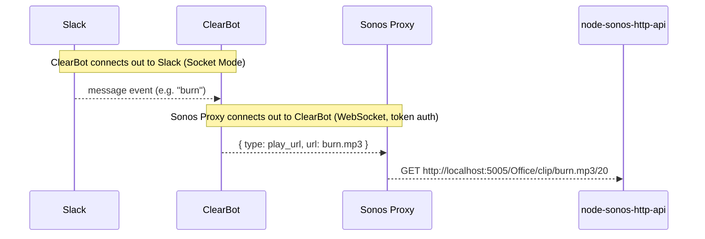

# Sonos Proxy

This code is a proxy between the
[clearbot](https://github.com/clearfunction/clearbot) and the
[node-sonos-http-api](https://github.com/jishi/node-sonos-http-api) library.

It connects _out_ to ClearBot over a native WebSocket (authenticating with a
shared `RELAY_TOKEN`), receives JSON commands, and proxies them to
node-sonos-http-api. The connection reconnects automatically with exponential
backoff if it drops.

## Architecture


```mermaid
sequenceDiagram
    Note over Slack,ClearBot: ClearBot connects out to Slack (Socket Mode)
    Slack-->>ClearBot: message event (e.g. "burn")
    Note over ClearBot,Sonos Proxy: Sonos Proxy connects out to ClearBot (WebSocket, token auth)
    ClearBot-->>Sonos Proxy: { type: play_url, url: burn.mp3 }
    Sonos Proxy-->>node-sonos-http-api: GET http://localhost:5005/Office/clip/burn.mp3/20
```

## Requirements

- NPM
- Node 20–22 (uses the built-in global `WebSocket`)

## Running Locally

- Set up [clearbot](https://github.com/clearfunction/clearbot)
- Put some mp3s in the `static/clips` directory (they correspond to the clearbot sounds defined in <https://github.com/clearfunction/clearbot/blob/main/src/responses.ts>.)
- Set up your `.env` file (see `.env.example`):
  - `CLEARBOT_URL` — the bot's WebSocket URL (`ws://localhost:3000` locally, `wss://…` in production)
  - `RELAY_TOKEN` — must match the value set on `clearbot`
  - `SONOS_BRIDGE_URL` — base URL of `node-sonos-http-api` (e.g. `http://localhost:5005`)
- If you don't have a Sonos speaker, then you can still use the local player... just ensure you've got `USE_LOCAL_SOUNDS` set to `true`
- If you _do_ have a Sonos speaker, then you'll also need the `node-sonos-http-api` running locally
- Ensure your `clearbot` is running. It has its own documentation.
- Run `npm run dev`
- Watch for `Connecting to <CLEARBOT_URL>` followed by `Connected to server` once it attaches to the bot. If you instead see a reconnect loop with a `code 1006` close immediately after connecting, the `RELAY_TOKEN` (or URL) is wrong.
- Enjoy!

## In the office

We set this up with
[`pm2`](http://pm2.keymetrics.io/docs/usage/quick-start/#setup-startup-script)
to daemonize it on the Mac Mini in our closet. Let's see how it works out for
us!

```sh
npm install               # installs this app
npm run tsc               # compiles to build/app.js
npm install pm2 -g        # installs the daemonizer
pm2 start ./build/app.js --name sonos_proxy  # assumes you're in this app's folder, starts the daemon
pm2 save                  # saves the running process as a daemon that will be auto-restarted even after reboots
```

## Resources

- [ClearBot](https://github.com/clearfunction/clearbot)
- [node-sonos-http-api](https://github.com/jishi/node-sonos-http-api)
